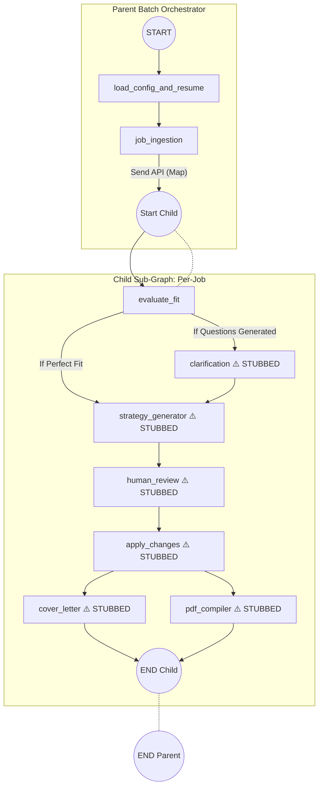

# JobStream Agent Review & Status Report

This document provides a comprehensive review of your LangGraph JobStream agent based on your repository's code, `master_board.json`, and the Product/Technical Requirements.

## 1. Overall Status & Node Completeness

Based on `master_board.json`, the project is complete up to **Feature F-07 (Evaluate Fit Node & Question Generation)**. The architecture for Map-Reduce (Parent/Child graphs), Web Scraping, Resume Parsing, and the first LLM interaction are fully operational.

### Parent Graph Nodes (Batch Orchestration)
*   **`load_config_and_resume` (COMPLETE):** Successfully reads `data/job_tracker.json` to get pending jobs and reads `data/json_resumes/` to load base resumes into memory.
*   **`job_ingestion` (COMPLETE):** Uses the custom stealth Web Scraper (`src/utils/scraper.py`) and HTML Parser to pull job descriptions from URLs or local text files, converting them into a structured `JobDetailsSchema`.

### Child Graph Nodes (Per-Job Execution)
*   **`evaluate_fit` (COMPLETE):** Invokes an OpenAI model (`gpt-4o`) using structured outputs to compare the parsed base resume with the scraped job details. It successfully outputs `ClarificationQuestion` items if context is missing.
*   **`clarification` (STUBBED):** Currently just a placeholder. (Pending F-11 Streamlit Interrupt UI).
*   **`strategy_generator` (STUBBED):** Currently a placeholder. (Pending F-08).
*   **`human_review` (STUBBED):** Currently a placeholder. (Pending F-12).
*   **`apply_changes` (STUBBED):** Currently a placeholder. (Pending F-14).
*   **`cover_letter` (STUBBED):** Currently a placeholder. (Pending F-15).
*   **`pdf_compiler` (STUBBED):** Currently a placeholder. (Pending F-16).

---

## 2. Mermaid Diagram of the Agent

Here is the current operational state of your LangGraph architecture:



---

## 3. How to Test Each Completed Node

### A. Testing the Resume to JSON Converter
1.  **Where to put the file:** Place a PDF, DOCX, or TXT version of your resume into `data/starter_resumes/`. **Crucial Naming Convention:** Name it `starter_{category}.pdf` (e.g., `starter_software_engineering.pdf`).
2.  **How it works:** The utility reads the file, parses the text, uses LLM/regex to structure it, and saves the output to `data/json_resumes/software_engineering.json`.
3.  **To run it manually:** Create a small script: `uv run python -c "from src.resume_converter import convert_starter_resumes_to_json; convert_starter_resumes_to_json()"`

### B. Testing Web Scraper & Job Ingestion
1.  **Where to put the URL/Text:** Edit `data/job_tracker.json`. 
    *   **For a URL:** Set `"source_type": "url"` and `"source": "https://boards.greenhouse.io/example/jobs/123"`.
    *   **For a Local File:** Save your job description text to a file like `data/job1.txt`. Set `"source_type": "file"` and `"source": "data/job1.txt"`.
2.  **How to test:** When the Parent Graph runs, the `job_ingestion` node will automatically read the tracker, scrape the URL (bypassing bot protections with undetected-chromedriver), parse the HTML, and return it.

### C. Testing Evaluate Fit
*   This node triggers automatically in the Child Graph. It takes the JSON from the base resume and the JSON from the ingested job and queries `gpt-4o`. To test this, you must have an `OPENAI_API_KEY` set in your environment variables.

---

## 4. Running the Agent in the Terminal

While your end goal is Streamlit (F-10), you can easily "fire it up" in the terminal right now to see LangGraph stream its states. 

**Create a file named `run_agent.py` in your project root:**
```python
import os
import json
from src.graph import parent_graph

# Ensure OpenAI API key is set
if not os.getenv("OPENAI_API_KEY"):
    print("Please set OPENAI_API_KEY environment variable.")
    exit(1)

# Start State
initial_state = {
    "config": {},
    "prompts": {},
    "scraped_jobs": [],
    "failed_jobs": []
}

# Provide a Thread ID for checkpointing (memory)
config = {"configurable": {"thread_id": "terminal-test-1"}}

print("🚀 Starting JobStream Agent...")
# Stream Mode outputs every node's updates as they finish
for event in parent_graph.stream(initial_state, config=config, stream_mode="updates"):
    for node_name, state_update in event.items():
        print(f"\n✅ Finished Node: {node_name}")
        
        # Add basic logging so you know what happened
        if node_name == "load_config_and_resume":
            print(f"   Found {len(state_update.get('pending_jobs', []))} pending jobs.")
        elif node_name == "job_ingestion":
            print(f"   Successfully scraped {len(state_update.get('scraped_jobs', []))} jobs.")
        elif node_name == "child_graph":
            print(f"   Child graph updated status: {state_update.get('status')}")
            if state_update.get('clarification_questions'):
                print("   ❓ Questions generated by LLM:")
                for q in state_update['clarification_questions']:
                    print(f"      - {q.question}")
```

**Run it via terminal:**
```bash
export OPENAI_API_KEY="sk-..."
uv run python run_agent.py
```

**Will it ask you questions in the terminal?**
Not yet. The Child Graph *generates* questions inside `evaluate_fit`, but the `clarification` node (which handles the human-in-the-loop pause) is currently a stub returning `{}`. Once Feature F-11 is implemented, LangGraph will yield an `__interrupt__`, pausing execution. You would then capture user input via Python's `input()` function and resume the graph with `parent_graph.invoke(Command(resume=...))`.

**Suggestions for Terminal UX:** 
For now, the `run_agent.py` script provided above includes sufficient print statements so you aren't staring at a blank screen.

---

## 5. Review of Prompts vs. Design Documents

I compared `src/nodes/evaluate_fit_node.py` against `agent-design-documents/prompt_details.MD`. 

**Status:** The current prompt requires updating.

**What is currently in code (`EVALUATE_FIT_PROMPT`):**
```text
You are an expert technical recruiter and career coach.
Your task is to evaluate the fit between the candidate's base resume and the job description.
Identify any missing context or clarification needed to tailor the resume effectively.
If there are missing details that could strengthen the application, formulate clarification questions.
```

**What is missing (per `prompt_details.MD`):**
1.  **Fit Scoring:** The PRD requests a 1-10 fit score and a `should_apply` flag if the score falls below a threshold (e.g., 3/10). *Currently, `EvaluateFitOutput` in `schemas.py` only contains a list of questions, with no score fields.*
2.  **Gap Analysis instruction:** The prompt does not explicitly instruct the LLM to identify completely missing requirements.
3.  **Forcing the LLM Option:** The prompt does not explicitly instruct the LLM to always provide a "Let the LLM decide" option (though `schemas.py` enforces this via a clever Pydantic `@model_validator`, it is best practice to also instruct the LLM to do so).

**Recommendation:** 
Before starting Epic 3's next features, you should expand `schemas.EvaluateFitOutput` to include `fit_score: int` and `should_apply: bool`, and enrich `EVALUATE_FIT_PROMPT` to include the specific directives detailed in `prompt_details.MD`.