# Agent Review Notes

Based on a thorough review of your codebase (`src/`, `planning/trackers/master_board.json`) and the project design documents (`PRD.md`, `TRD.md`, `prompt_details.MD`), here is the current status of the JobStream LangGraph agent.

## 1. Node Status & Completeness

The architecture and state management components are successfully established, but most of the logic (especially AI nodes) is currently stubbed out.

### Parent Graph
*   **`load_config_and_resume`**: **Complete**. Successfully loads `job_tracker.json` (or creates a dummy file if missing) and parses the base resumes from `data/json_resumes/*.json` into Pydantic models.
*   **`job_ingestion` (Web Scraper)**: **Incomplete (Stubbed)**. A `dummy_job_ingestion` function is in place. It conceptually passes jobs through but does not scrape URLs or parse raw text yet.
*   **`child_graph` (Map-Reduce)**: **Complete**. The mapping logic (`map_to_job_processor` using LangGraph's `Send` API) is built. It correctly matches a scraped job to the corresponding `base_resume` and fires off the child graph.

### Child Graph (Job Processing Pipeline)
All nodes in the child graph are currently **Incomplete (Stubbed)**. They exist in `src/nodes/child_nodes.py` but merely return empty dictionaries (`{}`).
*   `evaluate_fit`: Stubbed.
*   `clarification`: Stubbed.
*   `strategy_generator`: Stubbed.
*   `human_review`: Stubbed.
*   `apply_changes`: Stubbed.
*   `cover_letter`: Stubbed.
*   `pdf_compiler`: Stubbed.

### Standalone Utilities
*   **`resume_converter.py`**: **Complete**. This standalone script successfully parses `.pdf`, `.docx`, and `.txt` files into the required JSON schema format.

---

## 2. How to Test Each Node

Because the system relies heavily on stubs, testing currently requires some manual mocking.

*   **`resume_converter`**: You can test this right now. Place a PDF or Word resume anywhere on your machine and run: 
    ```bash
    uv run python -m src.resume_converter /path/to/resume.pdf software_engineering
    ```
    This will save a parsed JSON file to `data/json_resumes/base_resume_software_engineering.json`.
*   **`load_config_and_resume`**: Simply running the parent graph will trigger this. You can manually edit the `data/job_tracker.json` file to add jobs.
*   **`job_ingestion` (Web Scraper)**: Right now, this doesn't scrape anything. Once built, you will place the target job URL in the `source` field of `data/job_tracker.json` (with `source_type: "url"`). If you are using a raw text file, you would set `source_type: "text"` and place the text file path in the `source` field.
    *   *To test downstream nodes right now:* You must manually inject valid `JobDetailsSchema` dictionaries into the `scraped_jobs` state before triggering the `child_graph`.

---

## 3. Agent Architecture Diagram (Mermaid)

Here is a visual representation of the current LangGraph implementation:

```mermaid
graph TD
    subgraph Parent Graph
        START((START)) --> load_config[load_config_and_resume]
        load_config --> ingest[job_ingestion / Web Scraper]
        ingest -- Send API (Map-Reduce) --> child[child_graph]
        child --> END_P((END))
    end
    
    subgraph Child Graph
        START_C((START)) --> eval[evaluate_fit]
        eval --> clarify[clarification]
        clarify --> strat[strategy_generator]
        strat --> review[human_review]
        review --> apply[apply_changes]
        apply --> cover[cover_letter]
        cover --> pdf[pdf_compiler]
        pdf --> END_C((END))
    end

    %% Human in the loop interruption points configured in code
    style clarify stroke:#f66,stroke-width:2px,stroke-dasharray: 5 5
    style review stroke:#f66,stroke-width:2px,stroke-dasharray: 5 5
```


*(Nodes with red dashed borders indicate configured `interrupt_before` breakpoints for Human-in-the-Loop interaction).*

---

## 4. Running and Testing in the Terminal

Currently, if you want to run this in the terminal, you need to create a simple execution script (e.g., `main.py`) that invokes the `parent_graph`.

**How it works:**
1. You invoke the graph using `parent_graph.invoke({"pending_jobs": []}, config={"configurable": {"thread_id": "1"}})`.
2. Because the child graph uses `SqliteSaver` checkpointer and sets `interrupt_before=["clarification", "human_review"]`, the execution will physically pause when it reaches these nodes.
3. In a terminal script, you would detect this pause by checking the graph's state (`graph.get_state(config)`).

**Terminal Interactions:**
If you build a terminal harness, the questions the agent generates *can* be presented in the terminal. Your Python script would loop through `state.next`, check if it's paused at `clarification`, print the `clarification_questions` from the state, use Python's built-in `input()` to capture your text answers, update the state, and then call `invoke(None, config)` to resume execution.

**User Experience (UX) Recommendations:**
Right now, the nodes silently return `{}`. To make the terminal experience much better without relying solely on Streamlit:
1. **Streaming Output**: Instead of `graph.invoke()`, you should run the graph using `for event in graph.stream(...)`. This allows you to print to the terminal every time a node finishes.
2. **Logging/Print Statements**: It is highly recommended to add `print(f"--- Running {node_name} ---")` or use the `logging` library at the start of each node. This will show you exactly where the state machine is at any given time.

---

## 5. Prompt Alignment with `prompt_details.md`

Currently, **none of the prompts have been implemented**. 
Because all LLM-driven nodes (`evaluate_fit`, `strategy_generator`, `cover_letter`, etc.) are empty Python stubs (`return {}`), there are no prompt templates or LLM chains in the codebase yet to compare against your `prompt_details.MD` specifications.

When you transition from Epic 2 to Epic 3, you will need to map the instructions outlined in `prompt_details.MD` directly into LangChain `ChatPromptTemplate` configurations inside `src/nodes/child_nodes.py`.